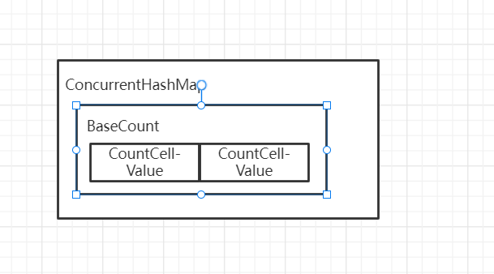

##### ConcurrentHashMap

```java
//不知道map中有多少元素，直接new调用如下构造方法，在第一次put时扩容。
ConcurrentHashMap map = new ConcurrentHashMap();
public ConcurrentHashMap() {
}
//一般开发时候，我们给一个初始容量，例如给32，初始容量是64
ConcurrentHashMap map = new ConcurrentHashMap(32);
public ConcurrentHashMap(int initialCapacity) {
        if (initialCapacity < 0)
            throw new IllegalArgumentException();
        int cap = ((initialCapacity >= (MAXIMUM_CAPACITY >>> 1)) ?
                   MAXIMUM_CAPACITY :
                   tableSizeFor(initialCapacity + (initialCapacity >>> 1) + 1)); //实际传入的参数是比32大一半+1的接近的一次幂次方数
        this.sizeCtl = cap;
}

private transient volatile int sizeCtl;
sizeCtl为0, 代表数组未初始化, 且数组的初始容量为16;
sizeCtl为正数，如果数字未初始化，记录的是数组的初始容量，如果已经初始化，记录的是数组的扩容阈值（数组的初始容量*0.75）
sizeCtl为-1，数组正在进行初始化
sizeCtl小于0，数组正在扩容，-（1+n）表示有n个线程正在扩容，1.8可以多个线程协助扩容。
```

###### put安全

```java
final V putVal(K key, V value, boolean onlyIfAbsent) {
	//不允许空值，空键
    if (key == null || value == null) throw new NullPointerException();
    //基于key计算hash值，并进行一定的扰动，这个值一定是正数，方便后面添加元素判断该节点的类型
    int hash = spread(key.hashCode());
    int binCount = 0;
    //死循环
    for (Node<K,V>[] tab = table;;) {
        Node<K,V> f; int n, i, fh;
        if (tab == null || (n = tab.length) == 0)
            tab = initTable();
        //利用CAS操作取出指定位置元素赋值给f，若为null则直接进行赋值
        else if ((f = tabAt(tab, i = (n - 1) & hash)) == null) {
            if (casTabAt(tab, i, null,
                         new Node<K,V>(hash, key, value, null)))
                break;                   // no lock when adding to empty bin
        }
        //协助扩容
        else if ((fh = f.hash) == MOVED)
            tab = helpTransfer(tab, f);
        else {
            V oldVal = null;
            //锁住要添加元素位置的节点，只会锁住单一节点
            synchronized (f) {
                //判断数据结构（树或者链表）
                if (tabAt(tab, i) == f) {
                    //链表结构
                    if (fh >= 0) {
                        binCount = 1;
                        //循环遍历链表，若一样则替代，否则链在尾部
                        for (Node<K,V> e = f;; ++binCount) {
                            K ek;
                            if (e.hash == hash &&
                                ((ek = e.key) == key ||
                                 (ek != null && key.equals(ek)))) {
                                oldVal = e.val;
                                if (!onlyIfAbsent)
                                    e.val = value;
                                break;
                            }
                            Node<K,V> pred = e;
                            if ((e = e.next) == null) {
                                pred.next = new Node<K,V>(hash, key,
                                                          value, null);
                                break;
                            }
                        }
                    }
                    //树结构
                    else if (f instanceof TreeBin) {
                        Node<K,V> p;
                        binCount = 2;
                        if ((p = ((TreeBin<K,V>)f).putTreeVal(hash, key,
                                                       value)) != null) {
                            oldVal = p.val;
                            if (!onlyIfAbsent)
                                p.val = value;
                        }
                    }
                }
            }
            //判断是否进行树化操作
            if (binCount != 0) {
                if (binCount >= TREEIFY_THRESHOLD)
                    //树化操作
                    treeifyBin(tab, i);
                if (oldVal != null)
                    return oldVal;
                break;
            }
        }
    }
    //维护集合长度，判断是否需要扩容
    addCount(1L, binCount);
    return null;
}
```

数组初始化

```java
private final Node<K,V>[] initTable() {
    Node<K,V>[] tab; int sc;
    while ((tab = table) == null || tab.length == 0) {
    	//如果sizeCtl的值（-1）小于0, 说明此时正在进行初始化没，让出CPU
        if ((sc = sizeCtl) < 0)
            Thread.yield(); // lost initialization race; just spin
        else if (U.compareAndSwapInt(this, SIZECTL, sc, -1)) {
            try {
                if ((tab = table) == null || tab.length == 0) {
                    int n = (sc > 0) ? sc : DEFAULT_CAPACITY;
                    @SuppressWarnings("unchecked")
                    Node<K,V>[] nt = (Node<K,V>[])new Node<?,?>[n];
                    table = tab = nt;
                    sc = n - (n >>> 2);
                }
            } finally {
                sizeCtl = sc;
            }
            break;
        }
    }
    return tab;
}
```

链表转换为树

```java
private final void treeifyBin(Node<K,V>[] tab, int index) {
    Node<K,V> b; int n, sc;
    if (tab != null) {
        //如果数组的长度小于64，先对数组进行扩容
        if ((n = tab.length) < MIN_TREEIFY_CAPACITY)
            //扩容为原来的两倍
            tryPresize(n << 1);
        else if ((b = tabAt(tab, index)) != null && b.hash >= 0) {
            synchronized (b) {
                if (tabAt(tab, index) == b) {
                    TreeNode<K,V> hd = null, tl = null;
                    for (Node<K,V> e = b; e != null; e = e.next) {
                        TreeNode<K,V> p =
                            new TreeNode<K,V>(e.hash, e.key, e.val,
                                              null, null);
                        if ((p.prev = tl) == null)
                            hd = p;
                        else
                            tl.next = p;
                        tl = p;
                    }
                    setTabAt(tab, index, new TreeBin<K,V>(hd));
                }
            }
        }
    }
}
```

维护数组长度



```java
private final void addCount(long x, int check) {
    CounterCell[] as; long b, s;
    //维护集合长度，判断是否需要扩容
    if ((as = counterCells) != null ||
        //只有一个线程来，basecount值不改变，直接进行+1操作成功
        !U.compareAndSwapLong(this, BASECOUNT, b = baseCount, s = b + x)) {
        CounterCell a; long v; int m;
        boolean uncontended = true;
        //否则对baseCount维护的数组进行维护，
        if (as == null || (m = as.length - 1) < 0 ||
            (a = as[ThreadLocalRandom.getProbe() & m]) == null ||
            !(uncontended =
              U.compareAndSwapLong(a, CELLVALUE, v = a.value, v + x))) {
            //如果数组为空，直接进行增加操作
            fullAddCount(x, uncontended);
            return;
        }
        if (check <= 1)
            return;
        //获取集合的长度
        s = sumCount();
    }
    //添加元素check大于0
    if (check >= 0) {
        Node<K,V>[] tab, nt; int n, sc;
        //判断集合长度是否>=需要扩容的阈值sizeCtl
        while (s >= (long)(sc = sizeCtl) && (tab = table) != null &&
               (n = tab.length) < MAXIMUM_CAPACITY) {
            int rs = resizeStamp(n);
            if (sc < 0) {
                if ((sc >>> RESIZE_STAMP_SHIFT) != rs || sc == rs + 1 ||
                    sc == rs + MAX_RESIZERS || (nt = nextTable) == null ||
                    transferIndex <= 0)
                    break;
                //有线程正在扩容，进行协助扩容
                if (U.compareAndSwapInt(this, SIZECTL, sc, sc + 1))
                    //nt记录的是新的数组
                    transfer(tab, nt);
            }
            //左移16位，首位为1，将sc变为一个负数
            else if (U.compareAndSwapInt(this, SIZECTL, sc,
                                         (rs << RESIZE_STAMP_SHIFT) + 2))
                transfer(tab, null);
            
            s = sumCount();
        }
    }
}
```

//对baseCount维护的数组进行增加操作

```java
// See LongAdder version for explanation
private final void fullAddCount(long x, boolean wasUncontended) {
    int h;
    //拿到线程对应的随机值，用来计算数组的角标
    if ((h = ThreadLocalRandom.getProbe()) == 0) {
        ThreadLocalRandom.localInit();      // force initialization
        h = ThreadLocalRandom.getProbe();
        wasUncontended = true;
    }
    boolean collide = false;                // True if last slot nonempty
    for (;;) {
        CounterCell[] as; CounterCell a; int n; long v;
        //判断数组是否为空，不为空进入，对value数组某一位置进行添加
        if ((as = counterCells) != null && (n = as.length) > 0) {
            if ((a = as[(n - 1) & h]) == null) {
                //若数组位置=0，则将其放入数组
                if (cellsBusy == 0) {            // Try to attach new Cell
                    CounterCell r = new CounterCell(x); // Optimistic create
                    if (cellsBusy == 0 &&
                        U.compareAndSwapInt(this, CELLSBUSY, 0, 1)) {
                        boolean created = false;
                        try {               // Recheck under lock
                            CounterCell[] rs; int m, j;
                            //进行元素添加
                            if ((rs = counterCells) != null &&
                                (m = rs.length) > 0 &&
                                rs[j = (m - 1) & h] == null) {
                                rs[j] = r;
                                created = true;
                            }
                        } finally {
                            cellsBusy = 0;
                        }
                        if (created)
                            break;
                        continue;           // Slot is now non-empty
                    }
                }
                collide = false;
            }
            //第一次不为空
            else if (!wasUncontended)       // CAS already known to fail
                wasUncontended = true;      // Continue after rehash
            //直接对CellValue值进行+操作
            else if (U.compareAndSwapLong(a, CELLVALUE, v = a.value, v + x))
                break;
            else if (counterCells != as || n >= NCPU)
                collide = false;            // At max size or stale
            else if (!collide)
                collide = true;
            else if (cellsBusy == 0 &&
                     U.compareAndSwapInt(this, CELLSBUSY, 0, 1)) {
                try {
                    //对数组进行初始化或扩容（多次自旋操作没有添加成功）
                    if (counterCells == as) {// Expand table unless stale
                        //数组初始容量=2或位运算进行扩容
                        CounterCell[] rs = new CounterCell[n << 1];
                        //将旧的元素拷贝到新的数组中
                        for (int i = 0; i < n; ++i)
                            rs[i] = as[i];
                        counterCells = rs;
                    }
                } finally {
                    cellsBusy = 0;
                }
                collide = false;
                continue;                   // Retry with expanded table
            }
            h = ThreadLocalRandom.advanceProbe(h);
        }

        else if (cellsBusy == 0 && counterCells == as &&
                 U.compareAndSwapInt(this, CELLSBUSY, 0, 1)) {
            boolean init = false;
            try {                           // Initialize table
                if (counterCells == as) {
                    CounterCell[] rs = new CounterCell[2];
                    rs[h & 1] = new CounterCell(x);
                    counterCells = rs;
                    init = true;
                }
            } finally {
                cellsBusy = 0;
            }
            if (init)
                break;
        }
        else if (U.compareAndSwapLong(this, BASECOUNT, v = baseCount, v + x))
            break;                          // Fall back on using base
    }
}
```

sumCount获取集合的长度

```java
final long sumCount() {
    CounterCell[] as = counterCells; CounterCell a;
    long sum = baseCount;
    //若数组不为空
    if (as != null) {
        for (int i = 0; i < as.length; ++i) {
            //遍历数组
            if ((a = as[i]) != null)
                sum += a.value;
        }
    }
    return sum;
}
```

数组进行扩容

```java
private final void transfer(Node<K,V>[] tab, Node<K,V>[] nextTab) {
    int n = tab.length, stride;
    //判断CPU的核数是不是大于1，n右移3位，最小任务单元16，如果<16就按照16个计算，否则就用计算的值
    if ((stride = (NCPU > 1) ? (n >>> 3) / NCPU : n) < MIN_TRANSFER_STRIDE)
        stride = MIN_TRANSFER_STRIDE; // subdivide range
    //nextTab为null，进行扩容
    if (nextTab == null) {            // initiating
        try {
            @SuppressWarnings("unchecked")
            //直接扩容为2倍
            Node<K,V>[] nt = (Node<K,V>[])new Node<?,?>[n << 1];
            nextTab = nt;
        } catch (Throwable ex) {      // try to cope with OOME
            sizeCtl = Integer.MAX_VALUE;
            return;
        }
        //记录新的数组
        nextTable = nextTab;
        //旧数组的size
        transferIndex = n;
    }
    int nextn = nextTab.length;
    //用来标识迁移过的节点，hashCode值是MOVED
    ForwardingNode<K,V> fwd = new ForwardingNode<K,V>(nextTab);
    boolean advance = true;
    boolean finishing = false; // to ensure sweep before committing nextTab
    for (int i = 0, bound = 0;;) {
        Node<K,V> f; int fh;
        //计算某个线程负责多少	
        while (advance) {
            int nextIndex, nextBound;
            if (--i >= bound || finishing)
                advance = false;
            else if ((nextIndex = transferIndex) <= 0) {
                i = -1;
                advance = false;
            }
            //任务分配
            else if (U.compareAndSwapInt
                     (this, TRANSFERINDEX, nextIndex,
                      nextBound = (nextIndex > stride ?
                                   nextIndex - stride : 0))) {
                bound = nextBound;
                i = nextIndex - 1;
                advance = false;
            }
        }
        if (i < 0 || i >= n || i + n >= nextn) {
            int sc;
            if (finishing) {
                nextTable = null;
                table = nextTab;
                sizeCtl = (n << 1) - (n >>> 1);
                return;
            }
            if (U.compareAndSwapInt(this, SIZECTL, sc = sizeCtl, sc - 1)) {
                if ((sc - 2) != resizeStamp(n) << RESIZE_STAMP_SHIFT)
                    return;
                finishing = advance = true;
                i = n; // recheck before commit
            }
        }
        else if ((f = tabAt(tab, i)) == null)
            advance = casTabAt(tab, i, null, fwd);
        else if ((fh = f.hash) == MOVED)
            advance = true; // already processed
        else {
            synchronized (f) {
                if (tabAt(tab, i) == f) {
                    Node<K,V> ln, hn;
                    if (fh >= 0) {
                        int runBit = fh & n;
                        Node<K,V> lastRun = f;
                        for (Node<K,V> p = f.next; p != null; p = p.next) {
                            int b = p.hash & n;
                            if (b != runBit) {
                                runBit = b;
                                lastRun = p;
                            }
                        }
                        if (runBit == 0) {
                            ln = lastRun;
                            hn = null;
                        }
                        else {
                            hn = lastRun;
                            ln = null;
                        }
                        for (Node<K,V> p = f; p != lastRun; p = p.next) {
                            int ph = p.hash; K pk = p.key; V pv = p.val;
                            if ((ph & n) == 0)
                                ln = new Node<K,V>(ph, pk, pv, ln);
                            else
                                hn = new Node<K,V>(ph, pk, pv, hn);
                        }
                        setTabAt(nextTab, i, ln);
                        setTabAt(nextTab, i + n, hn);
                        setTabAt(tab, i, fwd);
                        advance = true;
                    }
                    else if (f instanceof TreeBin) {
                        TreeBin<K,V> t = (TreeBin<K,V>)f;
                        TreeNode<K,V> lo = null, loTail = null;
                        TreeNode<K,V> hi = null, hiTail = null;
                        int lc = 0, hc = 0;
                        for (Node<K,V> e = t.first; e != null; e = e.next) {
                            int h = e.hash;
                            TreeNode<K,V> p = new TreeNode<K,V>
                                (h, e.key, e.val, null, null);
                            if ((h & n) == 0) {
                                if ((p.prev = loTail) == null)
                                    lo = p;
                                else
                                    loTail.next = p;
                                loTail = p;
                                ++lc;
                            }
                            else {
                                if ((p.prev = hiTail) == null)
                                    hi = p;
                                else
                                    hiTail.next = p;
                                hiTail = p;
                                ++hc;
                            }
                        }
                        ln = (lc <= UNTREEIFY_THRESHOLD) ? untreeify(lo) :
                            (hc != 0) ? new TreeBin<K,V>(lo) : t;
                        hn = (hc <= UNTREEIFY_THRESHOLD) ? untreeify(hi) :
                            (lc != 0) ? new TreeBin<K,V>(hi) : t;
                        setTabAt(nextTab, i, ln);
                        setTabAt(nextTab, i + n, hn);
                        setTabAt(tab, i, fwd);
                        advance = true;
                    }
                }
            }
        }
    }
}
```

判断数组是否为空，若数组为空，并且数组正在创建，就看能否直接对BaseCount进行++操作，若不能，进行自旋操作，直接能够成功。

不为空，则在对应位置创建CountCell对象，并且CountCell对象的Value进行+操作。若不能添加，就对重新计算hash值（重新找添加元素的位置）进行自旋操作重复添加。
